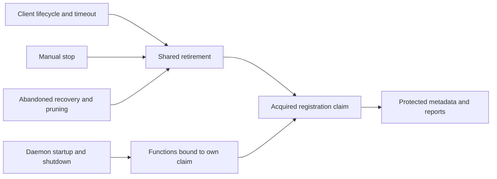

# Process lock exclusion

## Status

Accepted for the hardened host-kit protocol. Mixed access with the legacy host-kit protocol
is unsupported.

## Rules at a glance

- Publication, reclaim and release hold the same non-expiring mutation guard.
- The guard covers only filesystem compare-and-mutate steps. Owner liveness is judged before
  the guard is taken; under it, a reclaim only confirms that the record it judged is unchanged.
- Release waits a bounded time for a held guard. A guard still held after that bound leaves the
  release unverified, as an unprovable owner record or a directory it cannot remove also does.
- A claim identifies an acquisition; a PID alone cannot authorize release.
- Unknown owners and abandoned guards remain retained. Age never proves abandonment.
- Before upgrading, stop every legacy process using the shared state or cache paths. Keep
  legacy versions from returning while hardened users operate those paths. Use a single
  deployed version or separate environments; deleting a lock is not an upgrade procedure.
- Manual guard recovery requires external confirmation that every user of its paths stopped.

The implementation and its executable invariants live in
[`process-lock.ts`](../../packages/host-kit/src/internal/process-lock.ts) and its sibling tests.

## Why the guard does not expire

A process can pause after creating a directory or verifying a dead claim. Expiring its guard
lets another process enter, then the first process resumes and overwrites or deletes the
replacement. Retaining an uncertain guard trades automatic crash recovery for exclusion.

The guard is an exclusive file at the existing guard path. Legacy age-based `rmdir` cannot
remove it, so a fresh legacy reclaimer cannot steal a hardened publisher's guard. This does
not revoke a legacy reclaimer admitted before cutover: another legacy process may already
have stolen its directory guard. A real paused-child experiment reproduced both protocols
returning acquired after that older reclaimer resumed. Quiescence must cover all legacy
users, and continued mixed access remains unsupported.

A different lock path would split exclusion. A version check, an owner re-read or a new
guard cannot constrain legacy code after its final check. The support boundary therefore
requires deployment control; host-kit does not claim to detect or evict every legacy user.

Daemon registration has a separate cutover boundary: keep the same `daemon.lock` path and
refuse legacy files rather than automatically reclaiming them. A legacy daemon creates an
exclusive file; a hardened daemon creates a directory at that same path. The old acquisition
cannot unlink a directory, and the new acquisition retains an existing file.

The [registration tests](../../src/__tests__/daemon-registration-owner.test.ts) exercise real
children using the c237027737 legacy acquisition and the current owner. They cover an older
daemon already running, a hardened owner waiting to publish metadata, and concurrent startup.
The client refuses an older registration before signaling or changing it. This proves the daemon
cutover; it does not expand the host-kit mixed-protocol support contract. Older clients still
require the deployment controls above.

## Registration operations

[Shared retirement](../../src/daemon-registration-owner.ts) owns verified termination, protected
metadata inspection and removal, and release. Takeover, failed startup, replay cleanup, timeout
reset and manual stop await its result. Abandoned recovery uses the same protected retirement
sequence without signaling a live process. Daemon publication and shutdown use functions bound
to their acquired claim.

